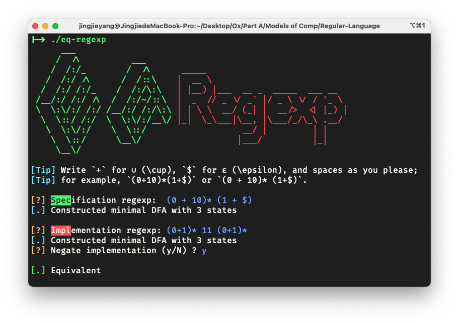
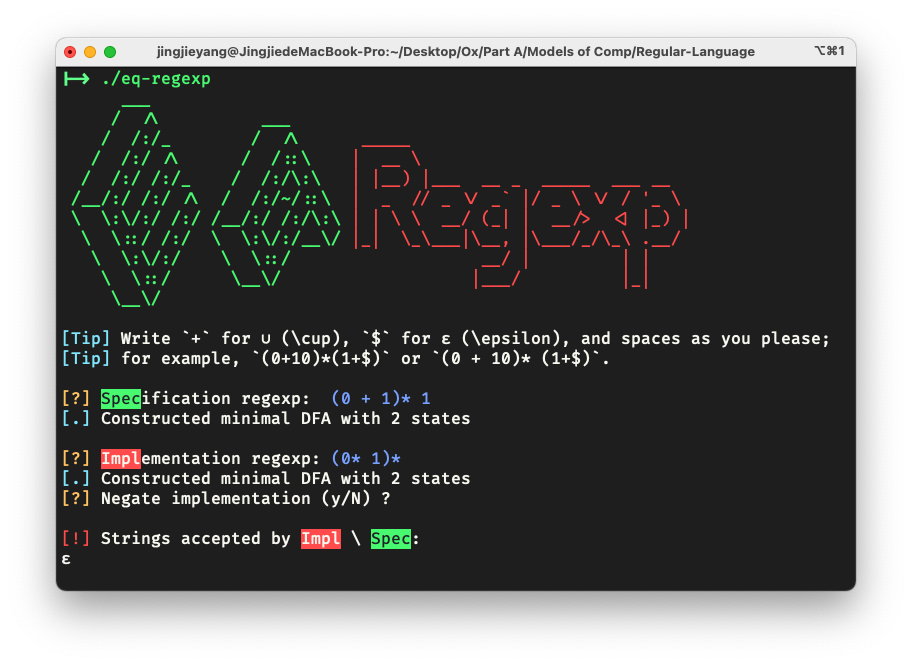

# Regular Languages Toolbox

* `DFA`: 
  acceptance; 
  complement and intersection;
  language emptiness and equivalence checking;
  minimisation
* `NFA`: 
  acceptance; 
  union, concatenation, and star;
  powerset construction `-> DFA`;
  Kleene's algorithm `-> Regexp`;
* `Regexp`:
  reversal;
  Thompson's construction `-> NFA`;
  monadic parser `<- String`;
  simplification using axioms of Kleene algebra from Kozen's book (highly experimental)

Docs hosted at https://pyxidatol-c.github.io/Regular-Language/ (incomplete).

## CLI: Regexp equivalence testing
Checks whether the specification regexp and (possibly the complement of) the implementation regexp are equivalent.
If not, a list of strings accepted by one but not the other will be displayed.

### Usage
```sh
ghc Main.hs -o eq-regexp
./eq-regexp
```
### Gallery



